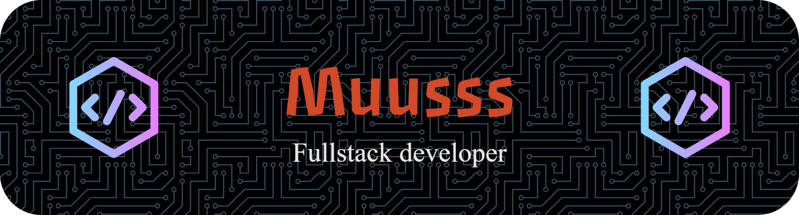

# 👋 Halo, saya Musa
**Fokus Teknik Informatika dan IT Support** — Mari kita bangun sesuatu yang luar biasa!

  

---

## 🔗 Temukan Saya

  
  

---

## 🛠️ Tech Stack

### Bahasa Pemrograman & Framework

  
  
  
  
  
  

### Tools & Platform

  
  
  

---

## 💡 Yang Saya Lakukan

- 🔧 **IT Support** — Troubleshooting, maintenance, dan optimization sistem
- 🗄️ **Database Management** — Design, optimization, dan backup strategy
- 🌐 **Web Development** — Membangun aplikasi web yang scalable dan maintainable
- 📚 **Continuous Learning** — Selalu belajar teknologi baru untuk meningkatkan skill

---

## 📫 Bagaimana Mencapai Saya

Jika Anda ingin berdiskusi tentang proyek, kolaborasi, atau hal-hal teknis — jangan ragu untuk menghubungi saya!

  

---

  <i>Terima kasih sudah mengunjungi profile saya!</i> 🙏

